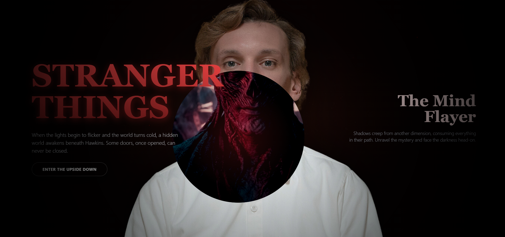

A visually immersive **Stranger Things** inspired web experience featuring an interactive "flashlight" reveal effect. Move your cursor to explore the Upside Down and reveal the true face of Vecna.

## 🕸️ Features

-   **Interactive Flashlight Effect**: A dynamic spotlight that follows your cursor, revealing the "Upside Down" version of the scene.
-   **Atmospheric Visuals**: Includes floating ash particles, flickering lights, and text gradients to match the show's aesthetic.
-   **Responsive Design**: Fully responsive layout that adapts seamlessly to desktop, tablet, and mobile screens.
-   **Smooth Animations**: Fluid mouse tracking and particle animations powered by vanilla JavaScript and CSS keyframes.

## 🛠️ Technologies Used

-   **HTML5**: Semantic structure.
-   **Tailwind CSS**: Utility-first styling for rapid UI development (loaded via CDN).
-   **JavaScript (ES6+)**: Logic for the flashlight effect, particle generation, and mouse interaction.
-   **Google Fonts**: _Playfair Display_ and _Inter_ for typography.

## 🚀 Getting Started

No build process is required! Since this project uses the Tailwind CSS CDN and vanilla JavaScript, you can run it directly.

1.  **Clone the repository** (if applicable) or download the files.
2.  Open `index.html` in your favorite web browser.
3.  Move your mouse (or touch on mobile) to explore the effect.

## 📂 Project Structure

```
UpsideDown/
├── assets/
│   ├── demo.png           # Preview image
│   ├── vecna_orginal.png  # Normal character image
│   └── vecna_monster.png  # Upside Down character image
├── index.html             # Main entry point containing HTML, CSS, and JS
└── README.md              # Project documentation
```

## 🎨 Credits

-   **Design Inspiration**: Stranger Things (Netflix)
